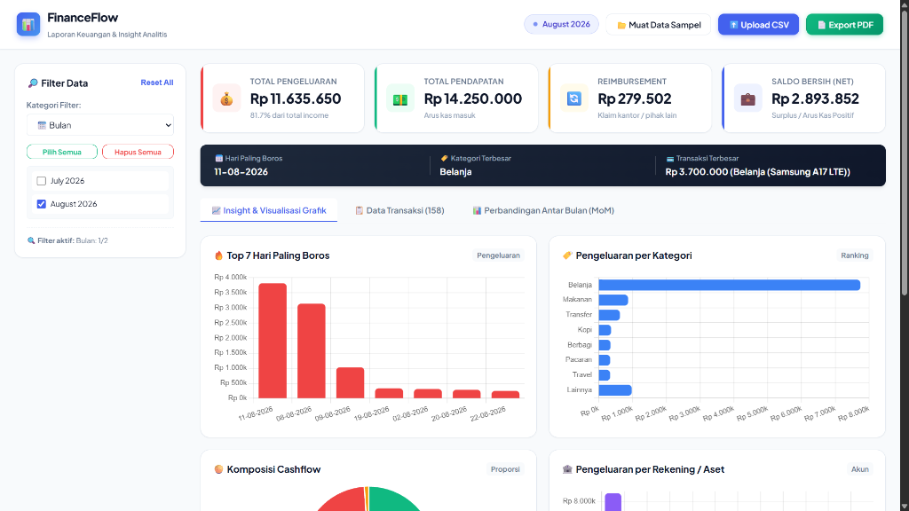
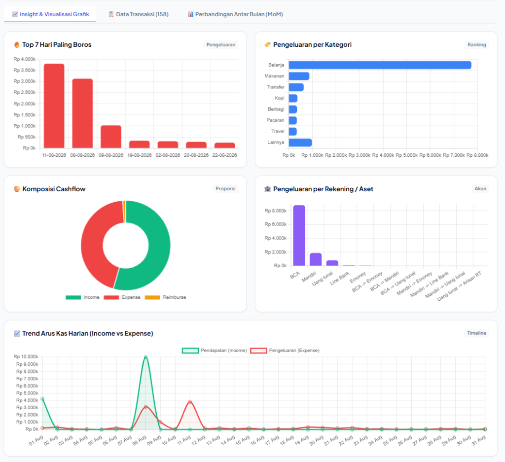
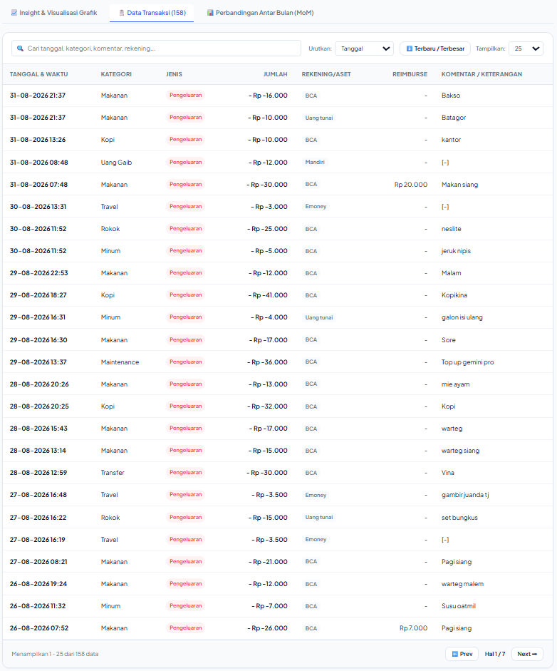
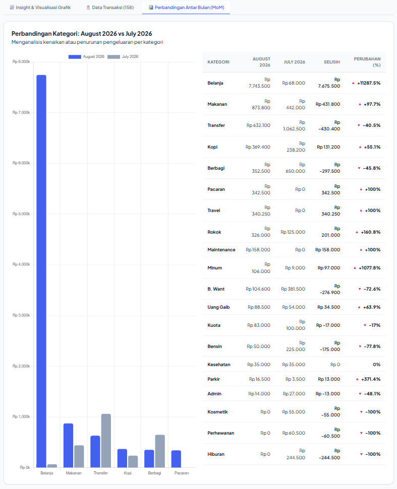
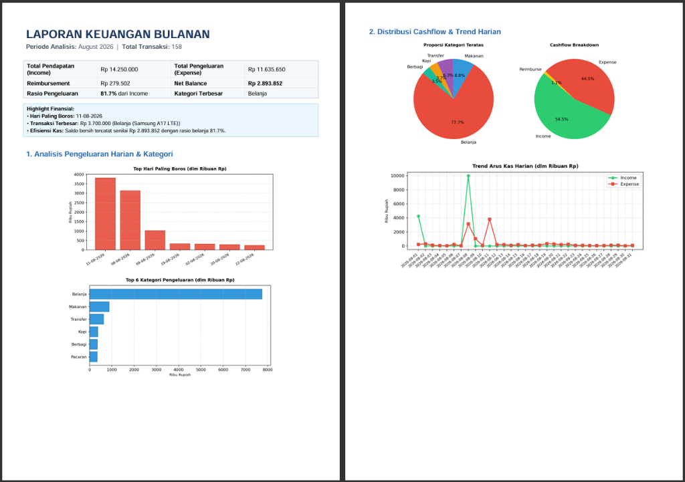
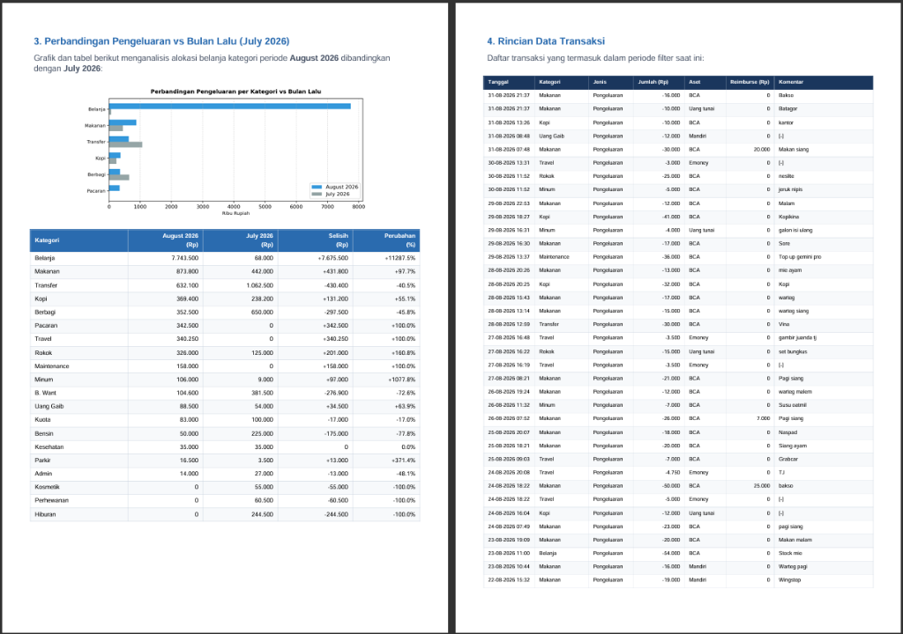

# 📊 FinanceFlow — Personal Financial Dashboard

<p align="center">
  
</p>

<p align="center">
  
  
  
  
  
  
</p>

---

## 📖 Tentang Proyek (Overview)

**FinanceFlow (`personal-finflow`)** adalah aplikasi web analitik dan visualisasi keuangan pribadi (*self-hosted personal finance dashboard & reporting engine*) yang dirancang untuk memberikan transparansi penuh terhadap arus kas (*cashflow*), kebiasaan belanja, dan kesehatan finansial bulanan.

Aplikasi ini **bukan tempat untuk mencatat transaksi harian dari nol**, melainkan sebuah **mesin analitik & pelaporan otomatis**. Proyek ini lahir dari kebutuhan nyata pribadi untuk mengolah data ekspor transaksi mentah (berformat CSV) yang dicatat melalui aplikasi pelacak pengeluaran di smartphone (seperti **[Meow Money Manager & Tracker](https://play.google.com/store/apps/details?id=com.financial.wallet)** di Google Play Store) atau pencatatan spreadsheet Excel pribadi, kemudian mengubahnya menjadi:
1. **Dashboard Interaktif**: Visualisasi grafik dinamis, rasio pengeluaran, deteksi anomali (*hari paling boros*, *transaksi terbesar*), dan sebaran aset/rekening.
2. **Analisis Komparasi Bulanan (MoM)**: Evaluasi naik-turun alokasi belanja dibanding bulan lalu.
3. **Automasi Laporan PDF (ReportLab)**: Menghasilkan arsip dokumen keuangan A4 profesional multi-halaman siap cetak dalam satu klik.

---

## 📋 Format & Struktur Data CSV (Data Specification)

Agar aplikasi dapat memproses data dengan benar, file CSV yang diunggah harus mengikuti skema header berikut (sesuai format bawaan hasil ekspor aplikasi *Meow Money Manager* atau file CSV/Excel buatan sendiri):

```csv
"Tanggal","Kategori","Jenis","Jumlah","Aset","Buku besar","Reimburse","Komentar"
"Agu 31 2026 21:37","Makanan","Pengeluaran","-16000","BCA","Bawaan","","Bakso"
"Agu 31 2026 07:48","Makanan","Pengeluaran","-30000","BCA","Bawaan","+20000","Makan siang"
"Agu 22 2026 15:19","","Transfer","21000","Mandiri -> Emoney","Bawaan","",""
"Agu 08 2026 20:49","Uang Jajan","Pendapatan","+10000000","BCA","Bawaan","",""
```

### Rincian Kolom CSV:

| Nama Kolom | Tipe Data | Contoh Nilai | Keterangan & Format |
| :--- | :--- | :--- | :--- |
| **`Tanggal`** | String / DateTime | `"Agu 31 2026 21:37"` | Format tanggal & jam. Parser mendukung singkatan bulan bahasa Indonesia (`Jan`, `Feb`, `Mar`, `Apr`, `Mei`, `Jun`, `Jul`, `Agu`, `Sep`, `Okt`, `Nov`, `Des`). |
| **`Kategori`** | String | `"Makanan"`, `"Belanja"` | Kategori pengeluaran/pendapatan (dapat dikosongkan pada transaksi mutasi internal/transfer). |
| **`Jenis`** | Enum / String | `"Pengeluaran"`, `"Pendapatan"`, `"Transfer"` | Klasifikasi arus transaksi. |
| **`Jumlah`** | Integer / String | `"-16000"`, `"+4250000"` | Nominal transaksi. Nilai minus (`-`) untuk beban/expense, nilai plus (`+`) untuk income. |
| **`Aset`** | String | `"BCA"`, `"Mandiri"`, `"Mandiri -> Emoney"` | Sumber dana, rekening bank, e-wallet, atau rute transfer saldo antar-rekening. |
| **`Buku besar`** | String | `"Bawaan"` | Nama buku kas / ledger (opsional/informasional). |
| **`Reimburse`** | String (Opsional) | `"+20000"`, `""` | Nominal pengeluaran yang diklaim/diganti oleh kantor atau pihak lain. |
| **`Komentar`** | String (Opsional) | `"Bakso"`, `"Token listrik"` | Catatan / deskripsi rincian keperluan transaksi. |

> 💡 **Tips Penggunaan Data:**
> * Jika menggunakan aplikasi **Meow Money Manager & Tracker**, Anda cukup masuk ke menu *Pengaturan / Backup* > *Ekspor ke CSV*, lalu langsung unggah file hasilnya ke FinanceFlow.
> * Jika mengelola pencatatan secara manual di Excel atau Google Sheets, simpan (*Save As*) ke format `.csv` dengan susunan kolom di atas.

---

## ✨ Fitur Utama (Key Features)

### 1. 🎛️ Dashboard & Core Financial KPIs
* **Ringkasan Finansial Instan**: Total Pengeluaran, Total Pendapatan, Reimbursement kantor/pihak ketiga, dan Saldo Bersih (*Net Balance*).
* **Rasio & Health Meter**: Menghitung persentase beban pengeluaran terhadap total pendapatan secara otomatis.
* **Highlight Cerdas**: Mendeteksi secara otomatis *Hari Paling Boros*, *Kategori Pengeluaran Terbesar*, dan *Transaksi Tunggal Terbesar* dalam periode terpilih.

### 2. 📈 Insight & Visualisasi Grafik Interaktif (Chart.js)
* **Top 7 Hari Paling Boros**: Peringkat 7 hari dengan akumulasi pengeluaran tertinggi untuk evaluasi gaya hidup.
* **Pengeluaran per Kategori**: Horizontal ranking chart untuk melihat alokasi anggaran terbesar (Belanja, Makanan, Transportasi, dll.).
* **Komposisi Cashflow**: Doughnut chart rasio Income vs Expense vs Reimburse.
* **Pengeluaran per Rekening/Aset**: Pemetaan sumber dana (BCA, Mandiri, E-Wallet, Uang Tunai, dll.).
* **Trend Arus Kas Harian**: Visualisasi tren timeline pemasukan vs pengeluaran harian sepanjang bulan.

### 3. 📊 Analisis Komparasi Antar-Bulan (*Month-over-Month / MoM*)
* Perbandingan kategori bulan aktif vs bulan sebelumnya secara *head-to-head*.
* Deteksi delta kenaikan/penurunan nominal dan persentase perubahan otomatis dengan indikator warna.

### 4. 🔍 Data Table Explorer & Smart Filter
* **Pencarian Instan**: Cari berdasarkan tanggal, nama kategori, rekening, atau komentar transaksi.
* **Multi-Sorting**: Urutkan berdasarkan Tanggal Terbaru, Nominal Terbesar, Reimburse, atau Expense.
* **Pagination Fleksibel**: Pilihan tampilan 10, 25, 50, hingga 100 baris data per halaman.

### 5. 📄 Export Laporan PDF Profesional (ReportLab Engine)
* Konversi seluruh ringkasan statistik, grafik beresolusi tinggi, tabel MoM, dan daftar rincian transaksi ke format **PDF A4 siap cetak multi-halaman**.
* Layout tabular dan visual yang rapi untuk arsip finansial bulanan pribadi.

### 6. 📂 Smart CSV Ingestion
* Dukungan *drag-and-drop* file CSV baru kapan saja tanpa reload server.
* Dilengkapi dataset bawaan (`sample_transaksi.csv`) untuk langsung mencoba seluruh fitur.

---

## 🛠️ Tech Stack

| Lapisan / Komponen | Teknologi | Deskripsi |
| :--- | :--- | :--- |
| **Backend Framework** | [Python](https://www.python.org/) & [Flask](https://flask.palletsprojects.com/) | Server REST API & route controller yang ringan dan cepat |
| **Data Processing Engine** | [Pandas](https://pandas.pydata.org/) | Preprocessing data CSV, agregasi metrik, dan kalkulasi MoM |
| **PDF Generation Engine** | [ReportLab](https://www.reportlab.com/) & [Matplotlib](https://matplotlib.org/) | Rendering dokumen PDF A4 multi-halaman & visualisasi grafik vektor beresolusi tinggi |
| **Frontend UI & Styling** | HTML5, Modern CSS (Glassmorphism), Plus Jakarta Sans | Tampilan dashboard modern, clean, dan responsif |
| **Interactive Charts** | [Chart.js](https://www.chartjs.org/) | Grafik visual interaktif dengan animasi halus di sisi browser |

---

## 📸 Tangkapan Layar & Demo (Screenshots Preview)

### 🖥️ Antarmuka Web Dashboard

#### 1. Dashboard Utama & Highlight Metrik
Tampilan ringkasan metrik finansial, kartu filter data, dan highlight hari boros.


---

#### 2. Insight & Visualisasi Grafik Lengkap
Grafik interaktif untuk komposisi cashflow, sebaran rekening bank, dan tren harian.


---

#### 3. Data Table Explorer & Pencarian Transaksi
Eksplorasi seluruh baris transaksi lengkap dengan fitur pencarian, filter, dan pagination.


---

#### 4. Analisis Komparasi Antar-Bulan (MoM)
Analisis kenaikan/penurunan pengeluaran per kategori dibanding bulan sebelumnya.


---

### 📄 Hasil Ekspor Dokumen Laporan PDF (ReportLab)

#### Halaman 1 & 2: Ringkasan Metrik, Analisis Harian, Distribusi Cashflow & Tren


---

#### Halaman 3 & 4: Tabel Perbandingan Antar-Bulan & Rincian Seluruh Transaksi


---

## 📋 Prasyarat Sistem (Prerequisites)

Sebelum menjalankan aplikasi, pastikan sistem Anda telah terpasang:
* **Python**: Versi `3.9` atau yang lebih baru ([Download Python](https://www.python.org/downloads/))
* **Pip**: Python Package Manager (otomatis terpasang bersama Python)
* **Web Browser**: Google Chrome, Microsoft Edge, Mozilla Firefox, atau browser modern lainnya

---

## 🚀 Panduan Instalasi & Menjalankan Proyek

### 1. Clone Repository
```bash
git clone https://github.com/AlzhaA/personal-finflow.git
cd personal-finflow
```

### 2. Buat & Aktifkan Virtual Environment (Direkomendasikan)
* **Windows (PowerShell/CMD):**
  ```powershell
  python -m venv venv
  .\venv\Scripts\activate
  ```
* **Linux / macOS:**
  ```bash
  python3 -m venv venv
  source venv/bin/activate
  ```

### 3. Install Dependensi
```bash
pip install -r requirements.txt
```

### 4. Jalankan Aplikasi

#### ⚡ Opsi A: Menggunakan File Batch (Khusus Windows - 1 Klik)
Cukup **klik ganda (double-click)** file:
```
run.bat
```

#### 💻 Opsi B: Melalui Terminal
```bash
python app.py
```

Aplikasi akan otomatis berjalan dan membuka browser Anda di:
```
http://127.0.0.1:5000
```

---

## 📁 Struktur Direktori (Folder Structure)

```
personal-finflow/
├── docs/
│   └── screenshots/          # Dokumentasi visual aplikasi & hasil cetak PDF
│       ├── 01-dashboard-overview.png
│       ├── 02-transaction-table.png
│       ├── 03-charts-insights.png
│       ├── 04-mom-comparison.png
│       ├── 05-pdf-report-preview-1.png
│       └── 06-pdf-report-preview-2.png
├── exports/                  # Direktori penampung file PDF yang diekspor
├── static/
│   ├── css/
│   │   └── style.css         # Styling antarmuka dashboard (Glassmorphism)
│   └── js/
│       └── app.js            # Handler interaktivitas frontend & integrasi Chart.js
├── templates/
│   └── index.html            # Template HTML antarmuka dashboard
├── .gitignore                # Aturan pengecualian file Git (cache, exports, venv)
├── app.py                    # Entry point server Flask & REST API endpoints
├── data_processor.py         # Engine preprocessing Pandas, agregasi metrik, & filter
├── pdf_generator.py          # Modul pembuat laporan PDF profesional (ReportLab)
├── requirements.txt          # Daftar dependensi library Python
├── run.bat                   # Script peluncur instan 1-klik di Windows
├── sample_transaksi.csv      # Dataset contoh transaksi siap uji
└── README.md                 # Dokumentasi resmi proyek
```

---

## 📄 Lisensi (License)

Proyek ini didistribusikan di bawah lisensi **MIT License** — bebas digunakan dan dikembangkan untuk keperluan personal maupun edukasi.

---

<p align="center">
  Dibuat dengan ❤️ oleh <b>Alzha</b> untuk pengelolaan finansial pribadi yang lebih cerdas dan terukur.
</p>
